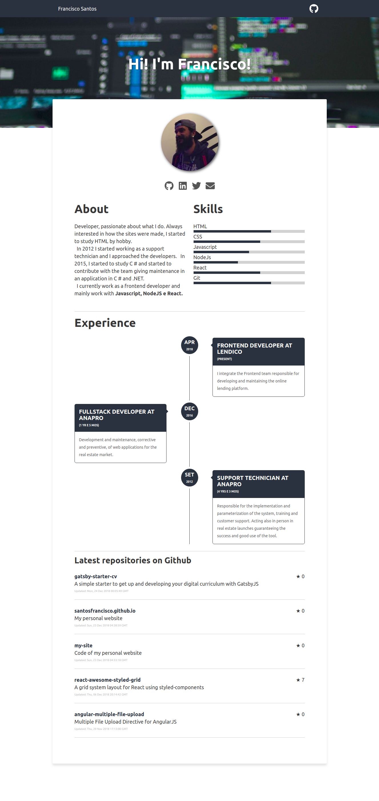

[](https://travis-ci.org/santosfrancisco/gatsby-starter-cv)
[](https://badge.fury.io/gh/santosfrancisco%2Fgatsby-starter-cv)
[](http://commitizen.github.io/cz-cli/)

<p align="center">
  <a href="https://www.gatsbyjs.org">
    
  </a>
</p>
<h1 align="center">
  Gatsby's CV starter
</h1>

Create your resume in a few minutes with this totally responsive starter using React. Show off your skills, work experiences and activities in github.


## 📷 Preview



## 🚀 Quick start

1.  **Create a Gatsby site.**

    Use the Gatsby CLI to create a new site, specifying the default starter.

    ```sh
    # create a new Gatsby site using the default starter
    npx gatsby new my-default-starter https://github.com/santosfrancisco/gatsby-starter-cv
    ```

1.  **Start developing.**

    Navigate into your new site’s directory and start it up.

    ```sh
    cd my-default-starter/
    npm run develop
    ```

1.  **Open the source code and start editing!**

    Your site is now running at `http://localhost:8000`!

    \_Note: You'll also see a second link: `http://localhost:8000/___graphql`. This is a tool you can use to experiment with querying your data. Learn more about using this tool in the [Gatsby tutorial](https://www.gatsbyjs.org/tutorial/part-five/#introducing-graphiql).\_

    Open the `my-default-starter` directory in your code editor of choice and edit `src/pages/index.js`. Save your changes and the browser will update in real time!

1. **Generate production build**

  That command will generate a production build on _public_ folder
  ```sh
    npm run build
  ```

## Configuration

Update the configuration file with your data. The configuration file is in ```data/siteConfig.js```

:warning: NOTE: Please change googleAnalyticsId to your ID.  See https://analytics.google.com for details.

> **Skills** is a set of your personal skills and their respective levels ranging from > 0 to 100.
> **jobs** is a set of your work experiences

```js
module.exports = {
  siteTitle: 'Bienvenue sur ma page!',
  siteDescription: `CV informatique en ligne de Sébastien Bilodeau de Québec.`,
  keyWords: ['gatsbyjs', 'react', 'curriculum'],
  authorName: 'Sébastien Bilodeau',
  twitterUsername: 'sebprogramming',
  githubUsername: 'sebprogramming',
  authorAvatar: '/images/avatar.jpeg',
  authorDescription: `En premier lieu Webmestre, mais forcé par la vie à devenir développeur React pour augmenter la rapidité des sites et pour l'intégration directe des API. Gatsby est aussi incroyable et j'ai fait cette page à partir d'un thème Starter. 
  <br /> <br />
  Je fais des sites web depuis 2003. Après avoir amplement expérimenté Wordpress, je cherche à rendre la qualité de mes sites meilleures: j'utilise maintenant Gatsby, React, Netlify, GraphCMS, GraphQL, JamStack mais tout est en progression continue :-).`,
  skills: [
    {
      name: 'HTML',
      level: 95
    },
    {
      name: 'CSS',
      level: 85
    },
    {
      name: 'Javascript',
      level: 30
    },
    {
      name: 'NodeJs',
      level: 50
    },
    {
      name: 'Gatsby',
      level: 50
    },
    {
      name: 'Git',
      level: 50
    },
    {
      name: 'Wordpress',
      level: 90
    },
    
    {
      name: 'Hosting, Cpanel, SMTP Servers',
      level: 90
    },
    {
      name: 'Adobe Suite: Photoshop, XD',
      level: 80
    }
  ],
  jobs: [
    {
      company: "Travailleur autonome",
      begin: {
        month: 'jan',
        year: '2012'
      },
      duration: null,
      occupation: "Consultant et webmestre",
      description: "Mandats pour informatique juridique, développement de sites web et hébergement web. Gestion et installation de téléphonie VOIP."
  
    }, {
      company: "Diverses entreprises",
      begin: {
        month: 'juin',
        year: '2012'
      },
      duration: '7 ans',
      occupation: "Investisseur, webmestre, technicien",
      description: "Développement d'affaires et d'entreprises grâce à Internet et surtout aux sites web et applications que j'ai installés et dont j'ai fait la maintenance. J'ai toujours géré ma téléphonie IP avec Voip.ms aussi."
    }, {
      company: "Diverses entreprises",
      begin: {
        month: 'set',
        year: '2005'
      },
      duration: '4 ans',
      occupation: "Directeur de comptes",
      description: "Vente et représentation publicitaires en lignes et dans divers médias à grande distribution. Ma passion pour l'internet des affaires s'est agrandie pendant cette période."
  
    },
    /* ... */
  ],
  social: {
    twitter: "https://twitter.com/sebprogramming",
    github: "https://github.com/sebprogramming",
    email: "sebastien.programmation@gmail.com"
  },
  siteUrl: 'https://sebastienbilodeau.info',
  pathPrefix: '/gatsby-starter-cv', // Note: it must *not* have a trailing slash.
  siteCover: '/images/cover.jpeg',
  googleAnalyticsId: '',
  background_color: '#ffffff',
  theme_color: '#25303B',
  display: 'minimal-ui',
  icon: 'src/assets/gatsby-icon.png',
  headerLinks: [
    {
      label: 'Sébastien Bilodeau',
      url: '/',
    }
  ]
}
```
